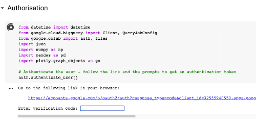
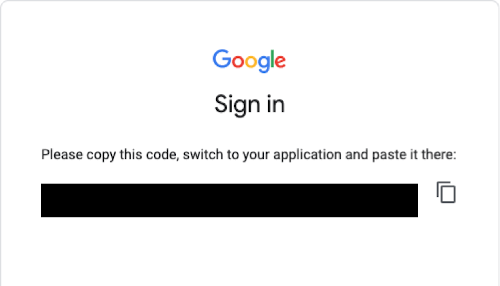
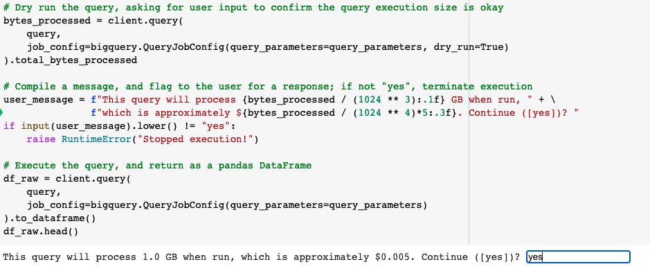
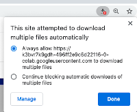

# How to execute the Reverse Path tool

> For detailed assumptions and caveats around using this tool, see the [assumptions and caveats log][assumptions].

1. Download the `Reverse path tool` notebook from GitHub
   - Go to [https://github.com/alphagov/govuk-user-journey-analysis-tools][repository], select `Code`, and `Download Zip`
   - Unzip the `govuk-user-journey-analysis-tools` folder and go to `notebooks`
   - Save `reverse-path-tool` notebook to your Google Drive account

  

2. Open up the `reverse-path-tool` notebook in Google Colab
   - Go to <https://colab.research.google.com/>
   - Navigate to Google Drive and open the notebook
   - You may need to 'connect' the notebook to be associated with Google Colab the first time you open a Jupyter notebook from Google Drive. To do this, look for the link at the top-centre of the page which says something like `Connect more apps` (see screenshot below), search for `Google Colaboratory` and then accept any required permissions it asks for

   

3. Once you have associated Jupyter notebooks with Google Colab, the notebook should open

## Running the notebook

You are now ready to run the notebook to execute the reverse path tool. To run a cell, you must hover over the empty square brackets to the left of a cell which will turn into a play symbol. Click the play symbol.

1. First, run the `Authorisation` cell
   - Once you've run the authorisation cell, you'll shortly see a prompt requesting that you navigate to a Google page
     to authorise Colab to obtain a verification token.

     

   - Clicking on the link takes you to a page that requests you sign in with your Google account, before asking for
     permissions

     

   - Once you click `Allow`, you'll be taken to a page where you're presented with a verification code

     

   - Copy this code by clicking the copy icon next to it and paste it back into the field in the notebook. Once you've
     done this, hit enter / return on your keyboard to complete authorisation
   - If at any point you receive a warning message telling you that "The notebook was not authored by Google", click on
     the `Run Anyway` option (see below)

     

2. Next, edit the `Set query parameters` cell.
   - There are a number of query parameters that are mandatory to set.
   - Mandatory: the date range for the analyses to run, the page path of interest, whether to use the first or last hit of the desired page in the session, the number of stages to include (i.e. the number of pages/events the journeys will be subsetted by), whether to include page and/or event hits, and the device category(ies) included in the analysis.
   - Optional: whether query strings are removed from the page path of interest, whether page paths associated with events are appended with an [E], whether page paths associated with events are appended with event information event category, event action, and/or event label, whether journeys that include the entrance page should be flagged, whether journeys that include the exit page should be flagged, whether refreshes of the page of interest should be removed, and finally whether search pages only show the search content type, and search keywords.

3. Once you are happy with the query parameters, ensure the cell is selected, select `Runtime`, then `Run after`
   - The notebook will run each cell following the `Set query parameters` cell one at a time.

4. The notebook should automatically scroll down to `cell 5`. If you are waiting what seems like a long time, then manually scroll down to `cell 5`.
   - This cell executes a dry run for the query, which estimates the number of gigabytes read by the query
   - If you are happy to continue, type `yes` into the user input box
   - Note: the query will only run if you type `yes` in the user input box. If you leave the input blank or type in
     something else, the query will not be executed, and the code will stop running

     

5. A local copy of the data generated is exported to a CSV file.
   - If no files are downloaded, check the end of the URL search bar. If you see a download icon with a red cross (as shown below), select the icon and change the option to `Always allow....` before clicking `Done`

     

6. A pseduo Sankey diagram is generated to summarise the top 10 and remainder journeys. 
   - Left click on the nodes and drag to adjust their position  
   - Hover over the diagram and click the `Download plot as a PNG` camera icon in the top right corner of the diagram

7. It is possible to also generate a Google Sheet displaying the top 10 journeys 
   - Under the `Presenting results in Google sheets` header, type `yes` into the user input box to confirm that you want to generate a Google Sheet
   - The URL to the Google Sheet in Google Drive is displayed in cell 21. 
   - Note: the query will only run if you type `yes` in the user input box. If you leave the input blank or type in something else, the query will not be executed, and the code will stop running

[assumptions]: ../aqa/assumptions-caveats-reverse-path-tool.md
[repository]: https://github.com/alphagov/govuk-user-journey-analysis-tools
