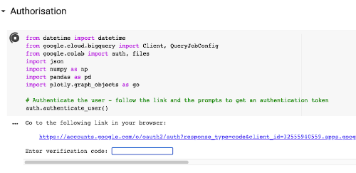
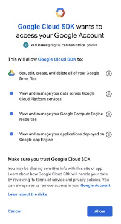

# How to generate the Spider Diagram tool

> For detailed assumptions and caveats around using this tool, see the [assumptions and caveats log][assumptions].

1. Download the `GDS - Spider Diagram Creator` notebook from GitHub
   - Go to [https://github.com/alphagov/govuk-user-journey-analysis-tools][repository], select `Code`, and `Download Zip`
   - Unzip the `govuk-user-journey-analysis-tools` folder and go to `notebooks`
   - Save `spider-diagram-tool` notebook to your Google Drive account

     

2. Open up the `spider-diagram-tool` notebook in Google Colab
   - Go to <https://colab.research.google.com/>
   - Navigate to Google Drive and open the notebook
   - You may need to 'connect' the notebook to be associated with Google Colab the first time you open a Jupyter
     notebook from Google Drive. To do this, look for the link at the top-centre of the page which says something
     like `Connect more apps` (see screenshot below), search for `Google Colaboratory` and then accept any required
     permissions it asks for

     

3. Once you have associated Jupyter notebooks with Google Colab, the notebook should open, and you should be presented
   with a screen similar to the screenshot below:

   

## Running the notebook

You are now ready to run the notebook to generate the Spider Diagram. It is advisable to run each cell at a time. To
run a cell, you must hover over the empty square brackets to the left of a cell which will turn into a play symbol.
Click the play symbol.

1. First, run the `Authorisation` cell
   - Once you've run the authorisation cell, you'll shortly see a prompt requesting that you navigate to a Google page
     to authorise Colab to obtain a verification token.

     

   - Clicking on the link takes you to a page that requests you sign in with your Google account, before asking for
     permissions

     

   - Once you click `Allow`, you'll be taken to a page where you're presented with a verification code

     

   - Copy this code by clicking the copy icon next to it and paste it back into the field in the notebook. Once you've
     done this, hit enter / return on your keyboard to complete authorisation
   - If at any point you receive a warning message telling you that "The notebook was not authored by Google", click on
     the `Run Anyway` option (see below)

     

2. Next, edit the `Set Input Variables Form`. Once edited, run the `Input Variables` cells
   - Here, you can tell the notebook the GOV.UK page you'd like to visualise entries and exits for, what date range
     you'd like to see these entries and exits over, whether you'd like to view page paths or page titles, and which
     device type(s) you'd like to include
   - It should be noted that `start_date` and `end_date` should be entered in the "YYYY/MM/DD" format (but it is much
     easier to use the date picker tool by clicking on the calendar icon)
   - You must tick at least one device type (Desktop, Mobile, Tablet), otherwise the code will not run and will raise a
     `ValueError`. You may tick as many device types as you want to. For example, if you tick Desktop and Tablet, and
     un-tick Mobile, the data generated will only include entry and exit data of the GOV.UK page specified for sessions
     carried out on a Desktop or Tablet device. It will not include sessions carried out on a Mobile device

3. Next, run the `Query -- Previous Page Path` cell

4. Next, run the `Query -- Acquisition Source` cell

5. Next, run the `Query -- Next Page Path` cell

6. Next, run the `Execute queries` cell
   - A dry run for the query is executed, which estimates the number of gigabytes read by the query
   - If you are happy to continue, type `yes` into the user input box
   - Note: the query will only run if you type `yes` in the user input box. If you leave the input blank or type in
     something else, the query will not be executed, and the code will stop running

     

7. Next, run the `Compile summary statistics` cell

8. Next, run the `Create plotly figure` cells
   - An interactive plotly figure will be generated
   - If you want to download the plot as a .png, hover the cursor over the figure and select the camera icon located
     in the top right-hand bar of icons

     

9. If you want to download a local copy of the data generated for the Spider Diagram tool, run the `Export data, and
   figure` cell
   - Three downloads will be executed: a .csv file of the entry and exit data, including the number and proportion of
     page views, a .html file of the plotly figure, and a text file of the metadata for the executed SQL queries
   - If none or only some files are downloaded, check the end of the URL search bar. If you see a download icon with a
     red cross (as shown below), select the icon and change the option to `Always allow....` before clicking `Done`

     

[assumptions]: ../aqa/assumptions-caveats-spider-diagram-tool.md
[repository]: https://github.com/alphagov/govuk-user-journey-analysis-tools
